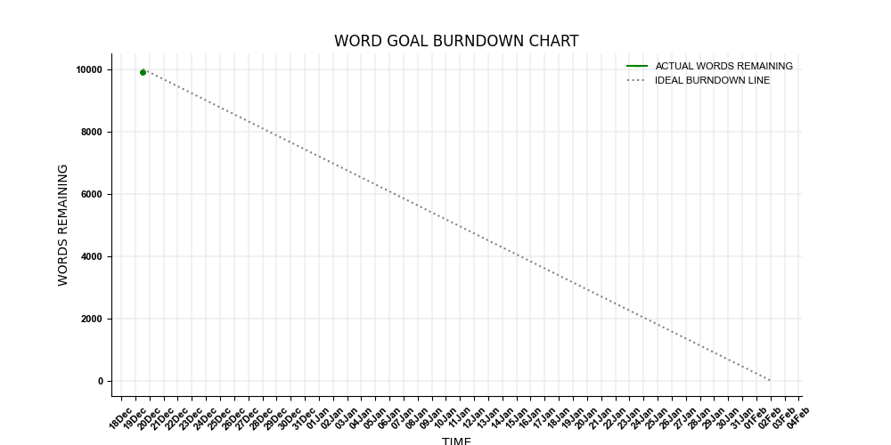
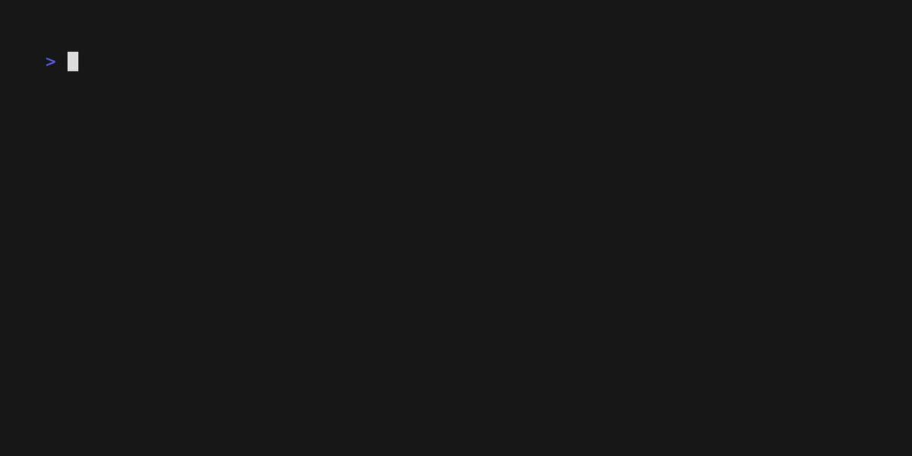

# Burndown Plotter for Writers

Project managers love burndown charts because they provide an immediate visual reference point for how far ahead or behind a project against a particular deadline. If the line is plotting above the ideal rate of progress, you're behind. If it's below, you're ahead. 

Burndown charts are perfect for something that's easily quantifiable and has a fixed, hard deadline, like a lot of writing can be. Anyone who has done extensive policy, legal or journalistic writing in particular knows what I mean. 

This is a simple python program that tracks progress on writing projects and plots them as a burndown chart. Supports multiple projects and storage in a single, human-readable CSV file.

## Installation

You'll need to get the require python packages with something like ``pip install matplotlib pandas``.

Use ``git clone https://github.com/oceanpenguin/writing-burndown-plotter.git`` and then ``cd`` into ``writing-burndown-plotter``. 

Start the script with ``python ./plot-writing.py``.

## Usage

